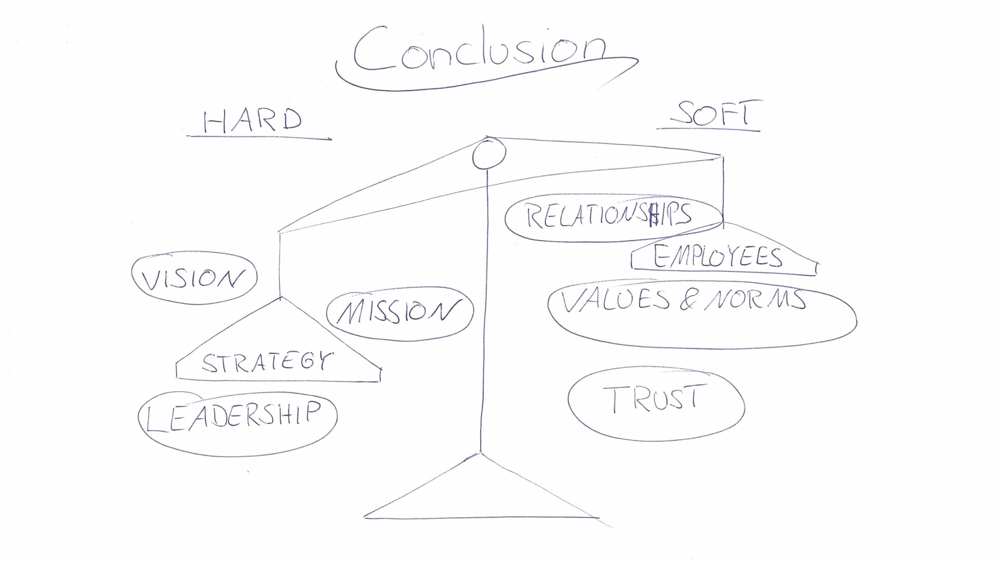

# Organizational Culture

### CBS SS 2021 Digital Organization

### _Viola Ates & Leon Blaeser_

---

### Agenda

1. Introduction
2. Definition
3. Reasoning
4. Iceberg-Model
5. Characteristics Hard-Culture (Enron)
6. Characteristics Soft-Culture (3M)
7. Miro Breakout Session
8. Implementation

---

### 1. Introduction

> _"Culture eats strategy."_

Peter F. Druckner (Austrian Management Consultant)

---

### 2. Definition

Results from the interplay of:

- Values
- Norms
- Attitudes
- Paradigms

... that employees collectively share.

Organizational culture forms the **action-shaping framework** of a company

---

### 3.1 Reasoning - Why do we need organizational culture?

- Company`s internal and external **identity**
- **Brand image** of the organization
- Controls employees **behaviour**
- Promotes **healthy relationships**
- Sets predefined policies for **internal alignment**

---

### 3.2 Reasoning - Why do we need organizational culture?

- Transforms employees into a team
- Helps to keep human resources in _War for talents_
- Supports onboarding

---

### 3.3 Reasoning - Why do we need organizational culture?

We need organizational culture because it supports:

- Trust in the organization
- Psychological safety
- Integrity
- Employer branding

---

### 4. Iceberg-Model

---

### 5.1 Characteristics Hard-Culture

A hard culture covers the "visible" factors of the Iceberg-Model:

- Strong & powerful climate (**Strategy**)
- Focus on organizational goals (**Compliance, Goals, Vision**)
- Top-down decision-making (**Structures, Policies, Procedures**)
- High hierarchies (**Structure, Policies**)

---

### 5.2 Example: Hard-Culture Enron

Enron: American energy & services company

- **Jeff Skilling** as COO and president
- Implemented hard-culture system _rank and yank_ which supported corruption and a lack of ethical decision-making
- Enron`s culture was only in **favor of its leaders**

---

### 5.2 Example: Hard-Culture Enron

**Extract from Enrons organizational culture:**

> _"[…]“The desire to sustain these rewards encouraged employees to engage in
> deal making and complicated, questionable accounting procedures that
> would help the company meet its quarterly earnings, with little concern
> about how this would impact the long term financial health of the
> company.” (Kerr, 1975)_

---

### 5.2 Example: Hard-Culture Enron

- Enron was very profitable at first...

**BUT:**

- 2001 Enron had to file for **insolvency**
- Hard but toxic culture lead to the **downfall**

---

### 6.1 Characteristics Soft-Culture

A soft culture covers the "invisible" factors of the Iceberg-Model:

- Values and ethical guidelines (**Rules, Values, Norms, Ideals**)
- Inclusion (**Status, Tradition**)
- Participation (**Rules, Relationship**)
- Equality (**Rules, Status**)
- Low hierarchies (**Rules, Status, Relationship**)

---

### 6.2 Example: Soft-Culture 3M

3M representor of 20th century innovations:

- Innovative & low hierarchical culture: 15% of working time could be spent on self-initiative projects
- Employees had direct ways to promote their own projects to exec. management

---

### 6.2 Example: Soft-Culture 3M

**Extract from 3Ms organizational culture:**

> _"[…] Management that is destructively critical when mistakes are made kills initiative. And its essential that we have many people with initiative if we are to continue to grow. (De Wit, 2020)"_

---

### 6.2 Example: Soft-Culture 3M

- 3M developed a new core competence
- Resulting in products such as: Post-It-Note, Cellotape, Magnetic tape

**BUT:**

- 1990s 3M lost grip on **financial** and **strategical** resources
- Too many costly investments
- No breakthrough product since Post-It note

---

### Back to the Iceberg-Model

---

### 7. Miro Breakout Session

---

### 8. Implementation

| **Team-oriented approach**      | **HR approach**               |
| ------------------------------- | ----------------------------- |
| Strategy implementation         | Specified hiring process      |
| Leaders as culture advocates    | Reward & recognition programs |
| Personalize employee experience | Onboarding programs           |
| Live company values / morals    | Assessment instrument         |

---

### Conclusion

---

### Conclusion

Result:

- Mixture between soft- & hard-culture is essential
  - Tendency towards harder culture
- One-way-cultures tend to tip over in the long-run
- Hierarchies should be taken out of the equation, but it should be ensured that leading management positions have appropriate soft skills

---

# Thank you for your attention!

## Any questions?

---

### References 1

"No rules rules, NETLFIX and the Culture of Reinvention", Hastings (2020)

"Strategy - an international perspective", De Wit (2020)

https://www.managementstudyguide.com/importance-of-organization-culture.htm

https://www.notredameonline.com/resources/business-administration/understanding-organizational-culture-and-its-benefits/

---

### References 2

https://sites.psu.edu/psy816mastroianni/2019/11/24/how-toxic-leadership-brought-down-the-enron-empire/​

https://www.3m.com/3M/en_US/ethics-compliance/code/about-our-code/

https://assets.kpmg/content/dam/kpmg/co/pdf/co-17-01-09-hc-five-steps-to-tackling-culture.pdf
